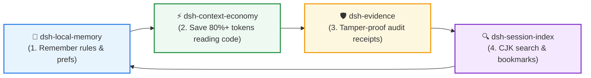

<div align="center">

# ⚡ dsh-context-economy

**Slash token costs for agent code reading via pointer & topology indexing**  
*Pointer-Based Lazy Reading • PageRank File Topology • Byte-Level Slices • 80–93% Token Savings*

[](https://github.com/huangjua)
[](#)
[](LICENSE)

[Features](#-key-features) • [Quick Start](#-quick-start) • [DSH Power Suite](#-dsh-power-suite) • [Tools](#-available-tools) • [简体中文](README_zh.md)

</div>

---

### Development fixes (0.0.2, A–G)

Graph queries use a per-file context map. Per-root refreshes are serial, use
asynchronous I/O and yield between batches; extraction, cache work and PageRank
run in a Worker. A single scoped background timer reconciles loaded roots every
`intervalMs` (default 300000 ms), skips overlapping ticks and stops on dispose.
Slice and JSON tools resolve only the requested file without indexing the project.

Internal cache v7 validates every required structure and rebuilds malformed or
older caches. The normalized extraction fingerprint includes parser version,
extensions, skipped directories, scan/context limits; the dependency parser update
also invalidates earlier v7 extractions. Failed reads remain pending for retry.
`updatedAt` tracks changes; `verifiedAt` tracks successful verification and
`staleMs`. Clean refresh writes only a generation-bound verification record.
Write failures remain observable without invalidating correct in-memory results.
Older v6 plugins rebuild v7 caches in their own format. Package identity, version,
peer ranges, runtime dependencies and local running configuration are unchanged.

`project_slice_read` uses half-open UTF-8 byte ranges: `lengthBytes` is the
returned byte count and `nextByteOffset` is the next content page's `startBytes`.
Character-boundary adjustments are explicit; even one-byte windows progress across
Chinese/emoji. The rendered continuation includes root and unambiguous JSON args.
Only another search uses `findFrom`. A hit at byte zero is visible; missing hits
have no placeholder offset. Window size is 1..16 MiB. Literal matching streams
across 64 KiB chunks, using per-code-point lowercase matching and original byte
positions (including expanding lowercase mappings). Each search owns one Worker,
with overall 1000 ms / literal 64 MiB or regex 16 MiB budgets (hard caps 10000 ms /
64 MiB). Regex runs on one continuous substring and reports
`searchScope=bounded_regex_window` with its byte range: anchors and lookaround
refer to that substring's boundaries. An incomplete regex scan cannot safely skip
its window; increase the budget at the same `findFrom`. Literal budget results
provide a safe continuation when progress exists. Cancellation and dispose wait
for Worker termination.

Dependency edges retain `specifier`, `status` and optional `target`; in/out
queries and topology use the same resolved target. Relative JS/TS imports support
explicit extensions, deterministic extensionless/index resolution, JS-to-TS
substitution and re-exports. For a TypeScript source's explicit .js reference,
.ts/.tsx/.d.ts precede .js/.jsx; .mjs tries .mts/.d.mts first and .cjs tries
.cts/.d.cts first. Extensionless TS sources try the exact indexed path, then
.ts/.tsx/.d.ts/.js/.jsx/.mts/.cts/.mjs/.cjs/.json; JS sources try
.js/.jsx/.ts/.tsx/.d.ts/.mjs/.cjs/.mts/.cts/.json. Directory index candidates
follow the same respective order. External packages, outside-root and unresolved
paths are distinguished. Sources with non-project or unresolved outgoing imports
are excluded from confirmed orphans. Reference spelling must match indexed filename case (including on Windows);
TS paths/package exports and complete language AST parsing remain outside
this lightweight resolver; Python supports basic relative modules/package imports,
not runtime sys.path, namespace packages, import lists, `from . import name`
or package alias semantics. Indegree counts reference edges,
including multiple references from the same source. Declaration lines no longer
include preceding blank lines, and final-line context does not require a newline.

`project_json_read` reads only one bounded page. Pass its `nextCursor` for the
next page; it binds normalized real path, file metadata fingerprint and scanner
version and an in-memory HMAC key per plugin load; file changes or plugin reload
require starting a new pagination session. No cursor key is persisted to disk. No completed previous items
are rescanned and no full-key spill array is retained. All page entries are rendered
with value previews and half-open UTF-8 byte pointers for `project_slice_read`.
`totalKeys` is absent while `totalKeysKnown=false`; only root closure and all
trailing bytes checked on the last page establish the total. Duplicate keys remain
separate entries. Validation distinguishes `complete`, `incomplete`,
`invalid`, `budget_exhausted` and `cancelled`; valid array/primitive roots
receive an unsupported-root diagnostic. Invalid files are never labelled valid.
`scannedBytes` counts consumed bytes; `readBytes` includes bounded prefetch.
Default page size is min(maxHits,1000); explicit limit is 1..1000. Other per-page
limits: output 64 KiB, key 4096 encoded bytes, depth 128, scan 16 MiB, time 2000 ms,
preview 240 characters; normalized file/root paths up to 1024 UTF-8 bytes.
The scanner reserves 8192 bytes for cursor and tool metadata within the page budget.
Resource exhaustion provides byte locations for slicing;
a single oversized value does not receive a cursor that repeats the same work.

The savings ledger records normalized effective roots on successes and failures
for symbols, imports, slice and JSON; `project_savings tool="project_json_read"`
is supported. Repeat hashes sort object keys, preserve array order and include
effective defaults. `savingsEnabled=false` bypasses serialization and ledger I/O.
Savings remain estimates against whole-file reading, not billed-token differences;
repeat estimates are not deduplicated. `maxHits` is a default quantity, not a
universal cap: explicit positive integer limits may exceed it for symbols/imports/
files/savings, with remaining items reachable via spill. JSON has its separate
1000-entry/page and byte budgets. `lowerNameOnly` is deprecated and retained for
configuration compatibility; symbol lookup always matches case-insensitively.

Run selected tests with `pnpm test slice symbols-imports json savings tools`;
include `cache graph lifecycle` after shared index/lifecycle changes. Build with
`pnpm build` before `pnpm pack:check`; package validation executes tools and
continuations from an extracted package. `scripts/bench-abc.mjs` measures graph
behavior, while `scripts/bench-json.mjs` records isolated 100k/1m-key first/later
page resources. These are isolated source/package checks, not desktop-process
end-to-end or desktop-version compatibility tests. This delivery completes D–G
(F2/F3/F4/F5/F7/F8/F9/F10) on the preserved A–C development copy.

---

### 💡 Why dsh-context-economy?

LLM context windows are finite and expensive. Dumping entire 2,000-line source files into prompts exhausts token budgets and severely degrades the model's reasoning capabilities.

**`dsh-context-economy` provides an ultra-compact code reading layer:**
- 💰 **80–93% Output Token Reduction**: Queries return minimal `path:line` pointers with brief context; oversized matches spill cleanly to disk.
- 🌐 **PageRank Dependency Topology**: Analyzes project imports (adapted from Aider's repomap algorithm) to prioritize central, high-frequency hub files (`hotspots`).
- 🔬 **Byte-Level Window Slicing (`project_slice_read`)**: Reads specific byte windows with regex find and tail tracking — built for huge single-line JS bundles and deep JSON.
- 📊 **Persistent Savings Accounting (`project_savings`)**: Automatically tracks token savings per turn against naive full-read baselines.

---

## 🚀 Quick Start

### Installation

```bash
# In your DSH plugin environment
dev_inject_plugin @dsh-external/dsh-context-economy
```

### Typical Usage Flow

1. **Find symbols with PageRank**: `project_symbols_find name="AuthHandler" ranking=true`
2. **Inspect dependency hotspots**: `project_imports direction="hotspots"`
3. **Query accumulated token savings**: `project_savings`

---

## 🧩 DSH Power Suite

This plugin is part of the **DSH Agent Power Suite** — 4 modular, zero-hard-dependency plugins forming a complete closed-loop developer workflow:



| Plugin | Role in Suite | Synergy with Context Economy |
|---|---|---|
| ⚡ **[dsh-context-economy](https://github.com/huangjua/dsh-context-economy)** | **Context Economy** (Current) | Provides index-backed pointer reading and topology to slash token expenditure. |
| 🧠 **[dsh-local-memory](https://github.com/huangjua/dsh-local-memory)** | **Memory Layer** | Frees up prompt tokens, leaving abundant budget for persistent memory snapshots. |
| 🛡️ **[dsh-evidence](https://github.com/huangjua/dsh-evidence)** | **Audit & Receipts** | Benchmark runs (`savings-bench`) generate verifiable evidence bundles registered into Evidence. |
| 🔍 **[dsh-session-index](https://github.com/huangjua/dsh-session-index)** | **Session Search** | Compact pointer output generates 80%+ smaller session logs, reducing search index load. |

---

## 📖 Deep Dive & Reference

<details>
<summary><b>🛠️ Available Tools (8 Tools)</b></summary>

| Tool | Description |
|---|---|
| `project_index_status` | View index stats, heal history, and manually refresh working-tree reconciliation. |
| `project_symbols_find` | Locate symbols by name/substring with optional PageRank ordering. |
| `project_imports` | Inspect in/out import edges, top-k `hotspots`, and `orphans`. |
| `project_files` | Cached fast glob listing relative project paths. |
| `project_slice_read` | Precision byte slicing with window / tail modes and ReDoS-protected regex find. |
| `project_json_read` | Bounded streaming scan of top-level JSON keys without full `JSON.parse` memory spikes. |
| `project_cost_probe` | Single-shot comparison probe between tool output and naive full-file reading. |
| `project_savings` | Query accumulated token savings ledger (grouped by tool/root with trend analysis). |

</details>

<details>
<summary><b>🏗️ Architecture & Self-Healing</b></summary>

- **Incremental Self-Healing Index**: Tracks `mtime + size` to re-scan only modified files on demand with one scoped background timer and cancellable workers.
- **Top-Level JSON Scanner**: Bounded byte parser with validated continuations and explicit JSON validation/budget states.
- **PageRank Algorithm**: Power-iteration algorithm with $\alpha=0.85$ and strict convergence tolerances.

</details>

<details>
<summary><b>🧪 Building & Testing</b></summary>

```bash
npm run typecheck
npm run check:dsh-contract
npm test
npm run build
npm run pack:check
```

</details>

---

<div align="center">
<sub>Part of the <a href="https://github.com/huangjua">DSH Agent Power Suite</a>. Licensed under BSD-3-Clause.</sub>
</div>
