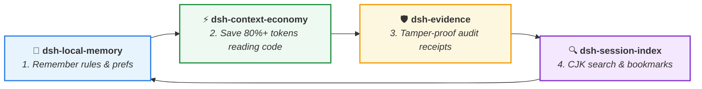

<div align="center">

# ⚡ dsh-context-economy

**Slash token costs for agent code reading via pointer & topology indexing**  
*Pointer-Based Lazy Reading • PageRank File Topology • Byte-Level Slices • 80–93% Token Savings*

[](https://github.com/huangjua)
[](#)
[](LICENSE)

[Features](#-key-features) • [Quick Start](#-quick-start) • [DSH Power Suite](#-dsh-power-suite) • [Tools](#-available-tools) • [简体中文](README_zh.md)

</div>

---

### 💡 Why dsh-context-economy?

LLM context windows are finite and expensive. Dumping entire 2,000-line source files into prompts exhausts token budgets and severely degrades the model's reasoning capabilities.

**`dsh-context-economy` provides an ultra-compact code reading layer:**
- 💰 **80–93% Output Token Reduction**: Queries return minimal `path:line` pointers with brief context; oversized matches spill cleanly to disk.
- 🌐 **PageRank Dependency Topology**: Analyzes project imports (adapted from Aider's repomap algorithm) to prioritize central, high-frequency hub files (`hotspots`).
- 🔬 **Byte-Level Window Slicing (`project_slice_read`)**: Reads specific byte windows with regex find and tail tracking — built for huge single-line JS bundles and deep JSON.
- 📊 **Persistent Savings Accounting (`project_savings`)**: Automatically tracks token savings per turn against naive full-read baselines.

---

## 🚀 Quick Start

### Installation

```bash
# In your DSH plugin environment
dev_inject_plugin @dsh-external/dsh-context-economy
```

### Typical Usage Flow

1. **Find symbols with PageRank**: `project_symbols_find query="AuthHandler" ranking=true`
2. **Inspect dependency hotspots**: `project_imports direction="hotspots"`
3. **Query accumulated token savings**: `project_savings`

---

## 🧩 DSH Power Suite

This plugin is part of the **DSH Agent Power Suite** — 4 modular, zero-hard-dependency plugins forming a complete closed-loop developer workflow:



| Plugin | Role in Suite | Synergy with Context Economy |
|---|---|---|
| ⚡ **[dsh-context-economy](https://github.com/huangjua/dsh-context-economy)** | **Context Economy** (Current) | Provides index-backed pointer reading and topology to slash token expenditure. |
| 🧠 **[dsh-local-memory](https://github.com/huangjua/dsh-local-memory)** | **Memory Layer** | Frees up prompt tokens, leaving abundant budget for persistent memory snapshots. |
| 🛡️ **[dsh-evidence](https://github.com/huangjua/dsh-evidence)** | **Audit & Receipts** | Benchmark runs (`savings-bench`) generate verifiable evidence bundles registered into Evidence. |
| 🔍 **[dsh-session-index](https://github.com/huangjua/dsh-session-index)** | **Session Search** | Compact pointer output generates 80%+ smaller session logs, reducing search index load. |

---

## 📖 Deep Dive & Reference

<details>
<summary><b>🛠️ Available Tools (8 Tools)</b></summary>

| Tool | Description |
|---|---|
| `project_index_status` | View index stats, heal history, and manually refresh working-tree reconciliation. |
| `project_symbols_find` | Locate symbols by name/substring with optional PageRank ordering. |
| `project_imports` | Inspect in/out import edges, top-k `hotspots`, and `orphans`. |
| `project_files` | Cached fast glob listing relative project paths. |
| `project_slice_read` | Precision byte slicing with window / tail modes and ReDoS-protected regex find. |
| `project_json_read` | Bounded streaming scan of top-level JSON keys without full `JSON.parse` memory spikes. |
| `project_cost_probe` | Single-shot comparison probe between tool output and naive full-file reading. |
| `project_savings` | Query accumulated token savings ledger (grouped by tool/root with trend analysis). |

</details>

<details>
<summary><b>🏗️ Architecture & Self-Healing</b></summary>

- **Incremental Self-Healing Index**: Tracks `mtime + size` to re-scan only modified files on demand without persistent daemon threads.
- **Top-Level JSON Scanner**: 64KB chunk-based depth scanner preventing OOM on massive configuration files.
- **PageRank Algorithm**: Power-iteration algorithm with $\alpha=0.85$ and strict convergence tolerances.

</details>

<details>
<summary><b>🧪 Building & Testing</b></summary>

```bash
npm run typecheck
npm run check:dsh-contract
npm test
npm run pack:check
```

</details>

---

<div align="center">
<sub>Part of the <a href="https://github.com/huangjua">DSH Agent Power Suite</a>. Licensed under BSD-3-Clause.</sub>
</div>
