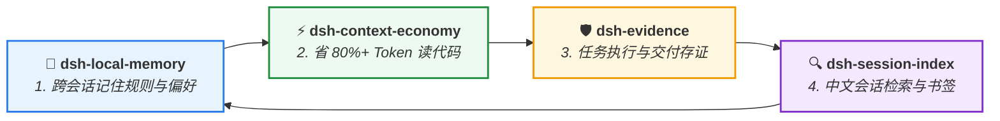

<div align="center">

# ⚡ dsh-context-economy

**把读代码的 Token 成本打下来！—— 符号与依赖图谱指针式懒加载**  
*指针式懒加载 • PageRank 依赖拓扑 • Byte 级切片 • 实测节省 80–93% Token*

[](https://github.com/huangjua)
[](#)
[](LICENSE)

[核心亮点](#-为什么需要上下文经济层) • [快速上手](#-快速上手) • [DSH 效率套件](#-dsh-agent-效率套件) • [工具列表](#-深度参考与架构) • [English](README.md)

</div>

---

### 💡 为什么需要上下文经济层？

LLM 上下文窗口寸土寸金。动辄将 2000 行源码整文件塞入 Prompt，不仅会迅速耗尽 Token 预算，还会严重稀释 Agent 的推理注意力。

**`dsh-context-economy` 为 Agent 读代码提供极致瘦身能力：**
- 💰 **单次查询节省 80–93% Token**：查询仅返回 `path:line` 极简指针与短上下文，超量命中自动落盘留索引。
- 🌐 **PageRank 拓扑依赖中心度**：自动分析项目 Import 引用关系，优先呈现高频被引用的核心枢纽文件（`hotspots`）。
- 🔬 **Byte 级精准切片 (`project_slice_read`)**：按字节窗口读取，专治超大单行打包 JS 与深层大 JSON。
- 📊 **常驻省流记账 (`project_savings`)**：每次查询自动与朴素整读基线对比，实时累计节省 Token 数与百分比。

---

## 🚀 快速上手

### 安装

```bash
# 在 DSH 插件环境中注入
dev_inject_plugin @dsh-external/dsh-context-economy
```

### 典型使用

1. **查符号并带拓扑排序**：`project_symbols_find query="AuthHandler" ranking=true`
2. **查核心依赖热点**：`project_imports direction="hotspots"`
3. **查实时省流账本**：`project_savings`

---

## 🧩 DSH Agent 效率套件

本插件是 **DSH Agent 开发者效率套件** 的核心成员 —— 4 个插件无硬依赖，组合使用实现完整工程闭环：



| 插件 | 套件定位 | 与上下文经济层的协作 |
|---|---|---|
| ⚡ **[dsh-context-economy](https://github.com/huangjua/dsh-context-economy)** | **上下文经济层** (当前) | 负责项目源码的高效索引、拓扑排序与字节切片。 |
| 🧠 **[dsh-local-memory](https://github.com/huangjua/dsh-local-memory)** | **本地记忆层** | 本插件大幅节省 Context 窗口，为长期记忆注入留出充足空间。 |
| 🛡️ **[dsh-evidence](https://github.com/huangjua/dsh-evidence)** | **审计存证层** | 本插件内置的基准实验（`savings-bench`）自动产出证据包登记到 Evidence。 |
| 🔍 **[dsh-session-index](https://github.com/huangjua/dsh-session-index)** | **会话历史检索** | 精简的指针输出减少了写入会话历史的数据量，大幅减轻索引与检索开销。 |

---

## 📖 深度参考与架构

<details>
<summary><b>🛠️ 8 个 project_* 工具列表</b></summary>

| 工具 | 作用 |
|---|---|
| `project_index_status` | 查看索引状态与自愈历史，手动触发工作区对账 |
| `project_symbols_find` | 查符号（返回 path:line 极简指针，支持 PageRank 排序） |
| `project_imports` | 查询 in/out 引用边；支持 `hotspots` 核心文件与 `orphans` 孤立文件 |
| `project_files` | 缓存 glob（快速获取相对路径列表） |
| `project_slice_read` | Byte 指针切片（支持 tail 模式与正则 find，大文件兜底） |
| `project_json_read` | 有界 JSON 顶层键分页扫描（防大 JSON OOM，配合切片回跳精读） |
| `project_cost_probe` | 输出 vs 朴素基线单次点测 |
| `project_savings` | 常驻记账查询：累计三类指针查询节省的 Token 数与统计聚合 |

</details>

<details>
<summary><b>🏗️ 增量自愈与拓扑架构</b></summary>

- **增量自愈索引**：通过 `mtime + size` 毫秒级按需重扫变更文件，无任何后台守护线程。
- **有界 JSON 流式扫描**：按 64KB 块深度计数流式跳过值，杜绝百万键 JSON 触发 OOM。
- **PageRank 中心度**：幂迭代算法，$\alpha=0.85$ 阻尼与精确收敛断言。

</details>

<details>
<summary><b>🧪 构建与测试</b></summary>

```bash
npm run typecheck
npm run check:dsh-contract
npm test
npm run pack:check
```

</details>

---

<div align="center">
<sub>属于 <a href="https://github.com/huangjua">DSH Agent 开发者效率套件</a> • 采用 BSD-3-Clause 开源协议</sub>
</div>
